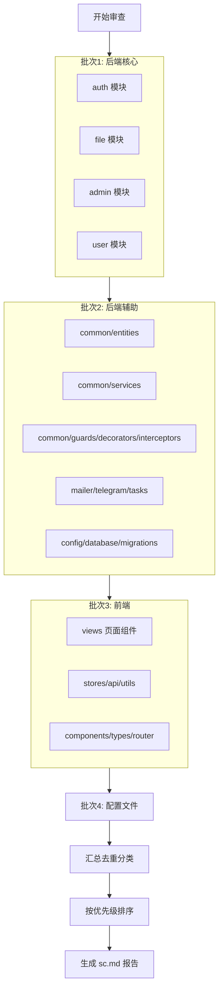

## 用户需求

对项目 `c:/预备重构` 执行一次全面的静态代码审查，覆盖 backend/src（约 50 个 .ts 文件）、frontend/src（约 27 个 .vue/.ts 文件）及根级配置文件（package.json、tsconfig.json、vite.config.ts 等）。

## 审查维度

- **代码规范**：命名一致性、结构清晰度、风格问题
- **逻辑缺陷**：空值处理、边界条件、控制流异常
- **安全漏洞**：注入风险、敏感信息泄露、认证授权缺陷、CORS/CSRF 风险
- **性能问题**：N+1 查询、不必要计算、内存泄漏、阻塞操作
- **类型安全**：any 滥用、不安全类型断言、缺失类型守卫
- **错误处理**：try-catch 缺失、异常吞没、资源泄漏
- **硬编码与配置**：硬编码密钥/URL、缺少环境变量抽象

## 输出要求

- 文件路径 + 行号 + 问题描述 + 修复建议
- 严重程度：Critical（严重）、Warning（警告）、Suggestion（建议）
- 按修复优先级排序（Critical 优先，同级别按文件路径排序）
- 输出到项目根目录 `sc.md`，结构清晰、易读

## 实施方案

### 审查策略

采用分层递进式审查，先整体后局部，分后端、前端、配置文件三个批次进行。

### 审查流程

### 审查标准

| 维度 | Critical（严重） | Warning（警告） | Suggestion（建议） |
| --- | --- | --- | --- |
| 安全 | SQL注入、密钥泄露、认证绕过、任意文件读取 | 日志泄露敏感信息、CSRF 未防护、弱加密 | CORS 配置过宽、错误消息暴露内部信息 |
| 逻辑 | 未处理异常导致崩溃、数据不一致风险 | 竞态条件、空值未检查导致运行时错误 | 边界条件可优化、控制流可简化 |
| 性能 | 无分页大数据查询、同步阻塞主线程 | N+1 查询、大文件未流式处理 | 缓存策略可优化、重复计算可提取 |
| 类型 | - | any 类型导致类型检查失效 | 类型断言可替换为类型守卫 |
| 规范 | - | 无错误处理、资源未释放 | 命名不一致、魔法数字、重复代码 |

### 输出文件结构

`sc.md` 将包含：

1. **报告摘要**：概况统计（文件数、问题总数、各级别数量）
2. **按严重程度分组问题列表**：每个问题含文件路径、行号、描述、修复建议
3. **建议修复顺序**：按严重程度→依赖关系排序的修复路线图

### 实施要点

- 使用 `[subagent:code-explorer]` 批量读取和分析源文件
- 对每个文件进行独立审查后统一汇总
- 同一问题在多文件出现时，列出所有出现位置
- 修复建议需具体可操作，给出代码示例

## 使用的 Agent 扩展

### SubAgent

- **code-explorer**
- 用途：分批深入读取 backend/src 和 frontend/src 下所有源文件，收集代码内容用于审查分析
- 预期成果：获取每个文件的完整内容，为逐文件代码审查提供基础数据，确保不遗漏任何代码文件

### Skill

- **Self-Improving Agent**
- 用途：在审查过程中记录发现的典型问题模式，提高后续审查的一致性和完整性
- 预期成果：积累问题模式库，确保同类问题不会遗漏，审查标准前后一致